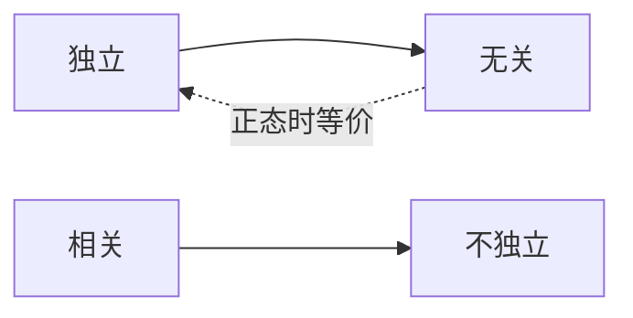
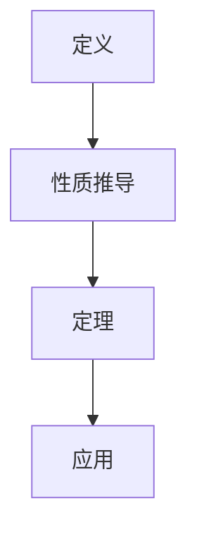

# 学习手册模板

> 📘 **学习手册** | L{N} {模式} ({分数档}) | 第{N}次学习
>
> 本章知识点：{count} 个 | 覆盖策略：{过滤规则描述}
>
> Persona: {当前 Persona}

## HTML 版质量准则（v1.6 新增）

以下为从实操中验证的 HTML 手册最佳实践，Markdown 模式参照执行：

1. **逐知识点展开**：每个 ⭐⭐⭐ 知识点必须有独立的小节（`<h3>` + 定义段 + 公式块 + 角色 blockquote），不得压成 bullet list
2. **公式块装饰**：关键公式用 `<div class="formula-block">`（左蓝边 `border-left: 3px solid #38bdf8`）包裹，次要公式可内联
3. **角色注入密度**：每 2-3 个知识点插入一条角色 blockquote（tip/warn），内容为角色视角的洞见或避坑提示
4. **图表优先**：概念关系用 Mermaid（graph TD/LR），公式推导链用 Mermaid（flowchart TD），信号波形用 ASCII
5. **图片必带 caption**：`<figure>` + `` + `<figcaption>` 三件套，`alt` 回退文本必填
6. **自检问题嵌入**：不放在"学完再看"的位置，而是紧随对应知识点之后
7. **CSS 常量**：`--accent:#38bdf8` `--star3:#fbbf24` `--star2:#a78bfa` `--success:#34d399` `--warn:#f97316`，禁止随意换色
8. **禁止行为**：将知识点压缩成纯表格、连续 5 段以上无公式/无图、blockquote 套 blockquote

---

## 🎯 学习目标

学完本章后，你应该能够：

- [ ] {目标1}
- [ ] {目标2}
- [ ] {目标3}
...

## 📋 前置要求

- {前置知识1}
- {前置知识2}

---

## 🗺️ 知识点提纲

{按等级过滤后的知识点树状结构，含 ⭐ 标记}

📊 统计：共 {N} 个知识点 | 约占全章的 {%}

---

## 📖 章节笔记

### {小节标题}

{详细笔记内容}

#### 🔄 可视化辅助（v1.2 新增）

在适当位置插入 Mermaid 图表或 ASCII 图示：

**概念关系图示例**：


**流程/推导图示例**：


**ASCII 图示（当 Mermaid 不可用时）**：
```
  独立 ──→ 无关
    ↑       │
    │正态时  │
    └───────┘
```

> 📝 可视化规则：
> - 概念间有"蕴含/等价/对比"关系时 → 使用关系图
> - 推导链条 ≥ 3 步时 → 使用流程图
> - 信号/函数形状重要时 → 使用 ASCII 波形图
> - 每章最多 3-5 个图表，避免信息过载

---

{根据 Persona 插入专属增强段落}

> 🔧 **工程启示**（Persona B 专属）
> {应用场景描述}

> 📐 **严格证明**（Persona C 专属）
> {充分/必要/充要条件辨析}

> ⏱ **十分钟速览**（Persona D 专属，放在手册开头）
> {核心要点速览框}

> 💡 **深入思考**（Persona E 专属）
> {拔高变体与陷阱}

---

## 📌 重点清单

| 知识点 | 重要度 | 学习指引 |
|--------|--------|---------|
| {知识点名} | ⭐⭐⭐ | {📐 重点推导 / 📝 背诵公式 / 💡 理解概念 / ✏️ 动手练习 / ⚠️ 注意区分} |

---

## ⚠️ 上次易错点（v1.2 新增 — 重学时注入）

> 仅当本章有错题集历史时显示此段。

基于你上次的错题，以下知识点需要特别注意：

| 知识点 | 上次错误类型 | 复习建议 |
|--------|-------------|---------|
| {知识点} | {概念混淆/计算错误/...} | {针对性建议} |

---

## 🔍 自检问题

学完本章后，你应该能回答以下问题。如果不能，请回到对应小节复习。

1. [概念] {问题}
2. [公式] {问题}
3. [对比] {问题}
4. [应用] {问题}
5. [推导] {问题}
...

---

## 📋 必背公式卡（Persona D 专属）

| 公式名称 | 公式 | 记忆口诀 |
|----------|------|---------|
| {名称} | $LaTeX$ | {口诀} |

---

## 📚 词汇表

| 术语 | 定义 |
|------|------|
| {术语} | {定义} |

---

## 🖼️ 图片索引

| 图片 | 页码/位置 | 说明 |
|------|----------|------|
| {图片名} | {位置} | {说明} |
